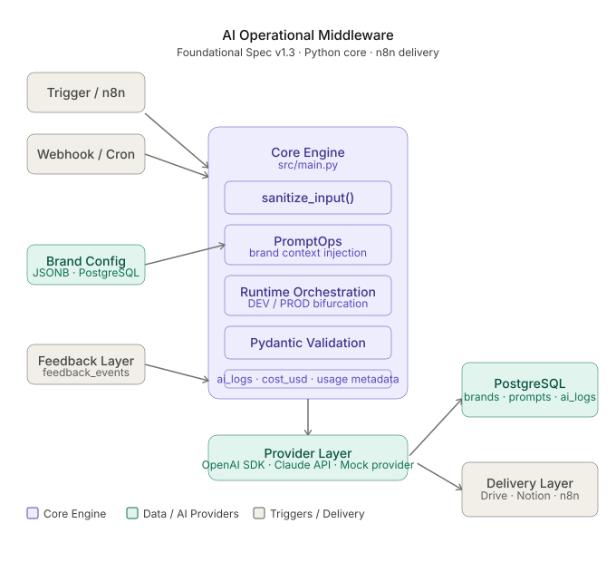

# AI Operational Middleware

AI-native operational middleware for automating repetitive marketing and digital operations workflows.

---

## Core Thesis

The future advantage of generative AI is not content generation itself.

The advantage is:
- operational coordination
- reusable workflows
- observability
- runtime orchestration
- persistent brand context

---

## Current Status

Architecture Phase: FASE 2 — Live Runtime Layer

Status: IN PROGRESS

---

## Architecture



```txt
Input Layer
    ↓
Core Runtime Engine
    ↓
Prompt Assembly Layer
    ↓
Provider Layer
    ↓
Pydantic Validation
    ↓
Observability & Logging
    ↓
Delivery Layer
```

---

## Current Features

- Runtime prompt assembly
- PromptOps versioning
- PostgreSQL logging
- Provider abstraction layer
- Structured outputs
- Development / Production bifurcation
- Operational observability
- Brand context injection
- Validation pipeline

---

## Tech Stack

- Python
- PostgreSQL
- OpenAI SDK
- Claude API
- Pydantic
- n8n

---

## Documentation

- `docs/foundational_spec.md`
- `docs/handoff_document.docx`

---

## Philosophy

This project is not focused on “AI content generation”.

The goal is to build reusable operational infrastructure for AI-assisted business workflows.