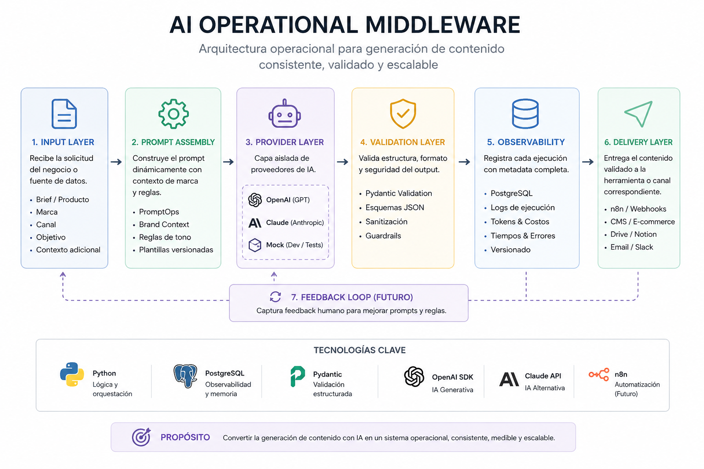

# AI Operational Middleware



> Operational infrastructure for AI-powered content generation workflows.

## Author

Juan Pablo Rodríguez Salas

LinkedIn: https://www.linkedin.com/in/juanpablorodriguezs/

---

# Overview

AI Operational Middleware is a Python-based runtime orchestration system designed to transform raw LLM outputs into controlled, observable and reusable business workflows.

This is not a ChatGPT wrapper.

The project introduces operational layers around AI generation, including:

* Runtime orchestration
* Brand context injection
* Security validation
* Structured output validation
* Cost monitoring
* Runtime intelligence
* Observability and logging

The core thesis behind the project is simple:

> Generative AI will make content a commodity. The competitive advantage will be the infrastructure that coordinates, validates and operates that generation reliably.

---

# Architecture

```text
Trigger Layer
(n8n / Webhooks / Cron)
        ↓

Runtime Interface Layer
(FastAPI / Streamlit)
        ↓

Runtime Pipeline
(runtime_pipeline.py)

  ├── Input Sanitization
  ├── Prompt Assembly
  ├── Budget Guard
  ├── Provider Execution
  ├── Structured Validation
  ├── Runtime Intelligence
  └── Persistence

        ↓

Provider Layer

  ├── OpenAI API
  ├── Mock Provider
  └── Future Providers

        ↓

Runtime Intelligence Layer

  ├── Brand Protection
  ├── Semantic Sanity Check
  ├── Output QA
  └── Confidence Scoring

        ↓

Persistence Layer

  ├── brands
  ├── prompts
  ├── ai_logs
  ├── api_pricing
  └── feedback_events
```

---

# Current Status

## Project Phase

✅ Runtime as a Service (MVP Complete)

The middleware has evolved from a simple AI runtime into a reusable operational platform capable of serving multiple interfaces and workflows.

---

# Features

## Runtime Orchestration

* Reusable execution pipeline
* Explicit runtime stages
* Provider abstraction layer
* Runtime configuration management

## PromptOps

* Brand-specific context injection
* Versioned prompts
* Structured prompt assembly

## Security & Governance

* Input sanitization
* Prompt injection protection
* Budget guardrails
* Invalid output detection
* Runtime safety checks

## Runtime Intelligence

* Brand protection validation
* Semantic sanity checks
* Output QA validation
* Confidence score generation

## Interfaces

* FastAPI runtime interface
* OpenAPI / Swagger documentation
* Streamlit operational dashboard

## Observability

* PostgreSQL persistence
* Token accounting
* Cost tracking
* Execution logs
* Runtime metadata monitoring

---

# Technology Stack

| Layer          | Technology         |
| -------------- | ------------------ |
| Backend        | Python             |
| API            | FastAPI            |
| UI             | Streamlit          |
| Validation     | Pydantic           |
| Database       | PostgreSQL         |
| AI Provider    | OpenAI API         |
| Workflow Layer | n8n                |
| Observability  | PostgreSQL Logging |

---

# Example Workflow

```text
Product Data
      ↓
Prompt Assembly
      ↓
OpenAI Runtime
      ↓
Pydantic Validation
      ↓
Runtime Intelligence
      ↓
Confidence Score
      ↓
PostgreSQL Logging
      ↓
Delivery Layer
```

---

# Example Input

```json
{
  "brand_id": 1,
  "name": "Monstera Deliciosa",
  "details": "Indoor tropical plant"
}
```

# Example Output

```json
{
  "caption": "Transform your space with the lush beauty of a Monstera Deliciosa...",
  "hashtags": [
    "#urbanjungle",
    "#plantlover",
    "#indoorplants"
  ],
  "cta": "Visit the link in our bio.",
  "platform": "instagram",
  "confidence_score": 92
}
```

---

# Design Principle

## Python is the brain. Workflows are the transport layer.

Business logic lives in Python.

External systems can trigger executions, move data and distribute outputs, but operational decisions remain inside the middleware.

---

## Origin

This project started while building content systems for small businesses using generative AI.

At first, the focus was on content itself: captions, images, prompts and creative outputs. But after repeated execution, a different pattern emerged.

The bottleneck was rarely content generation.

The real challenge was everything around it:

* Maintaining brand consistency
* Managing prompts across clients
* Validating outputs before delivery
* Tracking costs and usage
* Monitoring execution quality
* Building repeatable operational workflows

At some point, it became clear that the problem was not content.

The problem was the infrastructure required to operate content generation reliably.

AI Operational Middleware was built as an exploration of that idea: treating AI generation not as a single API call, but as an operational system with orchestration, validation, observability and governance layers.

The project evolved into a practical study of AI Operations, Runtime Engineering and Operational Intelligence.

---

# Roadmap

## Version 1.0

✅ Runtime orchestration

✅ FastAPI interface

✅ Streamlit dashboard

✅ Runtime intelligence

✅ Observability

✅ Cost monitoring

✅ Structured validation

## Future Exploration

* Few-shot retrieval
* n8n delivery adapters
* Image generation workflows
* AI Content Engine built on top of the middleware

---

# Demonstrated Capabilities

The current MVP demonstrates:

- Runtime orchestration through a reusable generation pipeline
- FastAPI service layer exposing AI workflows through REST endpoints
- Streamlit operational dashboard for testing and validation
- Structured output validation using Pydantic
- Runtime Intelligence Layer for QA, semantic checks and confidence scoring
- PostgreSQL persistence for observability, logging and cost tracking
---

Version 1.0 — Runtime as a Service MVP

Built by Juan Pablo Rodríguez Salas
GitHub: https://github.com/JPRO21
LinkedIn: https://www.linkedin.com/in/juanpablorodriguezs/


